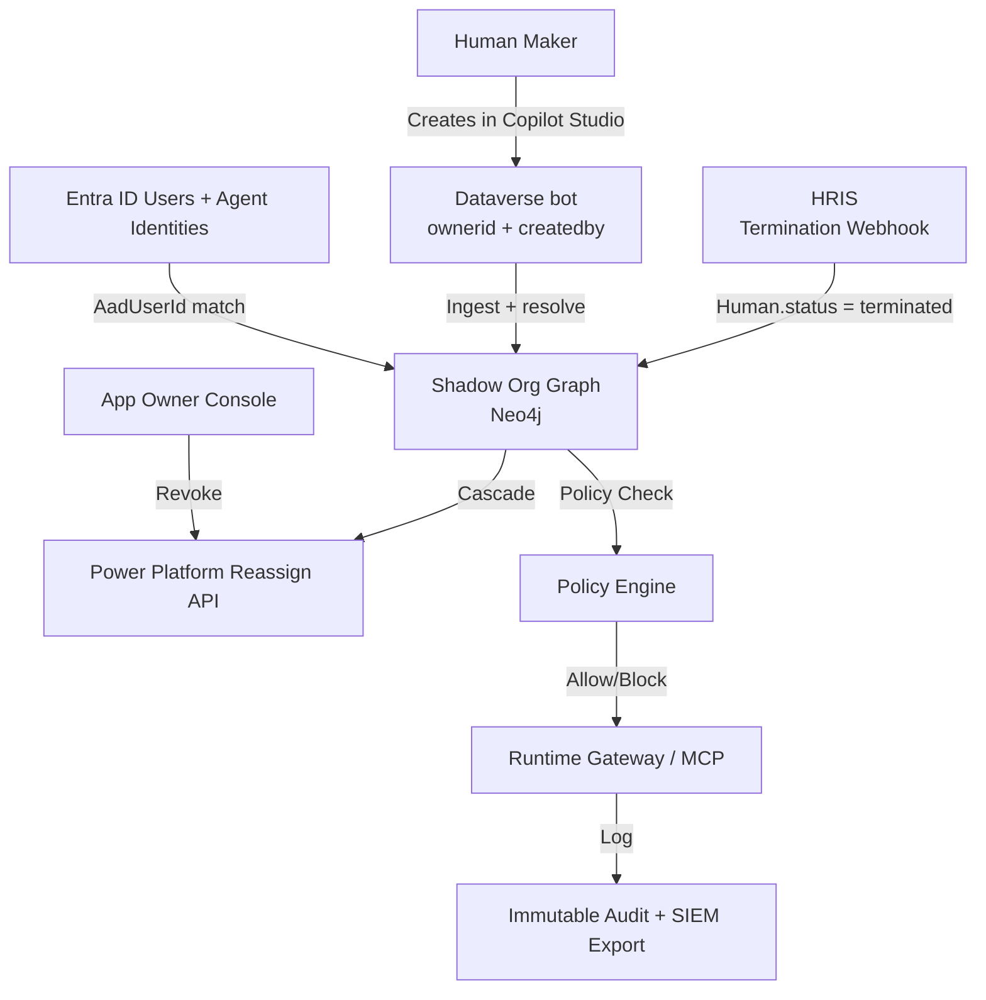

# How Pedigree Works — Technical Explainer
**Version:** 1.0  
**Date:** April 27, 2026  
**Audience:** Technical buyers (IAM, Security, Platform teams), Microsoft partners, design partners.

---

## The Core Thesis in One Diagram

```
HRIS (Workday / UKG / ADP)
        │
        ▼
   Human Nodes (live org chart with manager chain, entitlements, status)
        │
        │  (auto-matched on Entra AadUserId / email)
        ▼
   Agent Nodes (Copilot Studio bot, Entra Agent ID, custom, etc.)
        │
        │  (strict scope inheritance + policy evaluation)
        ▼
   Runtime Enforcement (MCP-aware gateway / Entra token exchange / action proxy)
        │
        │  (SoD, DLP, parent scope check on every tool call)
        ▼
   Audit + App Owner Console + Cascade Deprovision (on HR termination)
```

**Every agent is a digital child of the human who created it.**  
The human org chart (authoritative from HRIS) becomes the single source of truth for ownership, scope, approvals, and lifecycle.

---

## Step-by-Step Flow (MVP — Microsoft Copilot Studio Focus)

### 1. Ingestion & Attribution (Continuous)
- **HRIS Sync:** Full load (initial) + incremental (daily + webhook on termination/promotion). Maps standard fields → `:Human` nodes + `:MANAGES` edges in Neo4j.
- **Microsoft Sync:** Dataverse Web API polls or receives webhooks on `bot` create/update/owner change. Pulls `ownerid`, `createdby`, `botcomponent` (topics, knowledge, actions).
- **Resolution:** Entra AadUserId / UPN / email → match to HRIS Human (exact + fuzzy ML fallback).
- **Result:** Agent node created with `owner_human_id` + `scope_snapshot` (knowledge sources + actions at creation time) + `justification`.

### 2. Scope Inheritance & Policy at Creation
- Snapshot parent's live entitlements (Entra groups + HRIS roles + SharePoint access via Graph).
- Policy Engine evaluates against active rules (scope cap, SoD matrix).
- If violation: Flag + (in strict mode) block creation or require approval.
- Agent node stores the "intended" scope envelope forever (can only be tightened later).

### 3. Runtime Enforcement (Stub → Full Gateway)
- **Current (MVP):** Custom connector or proxy endpoint in Copilot Studio actions calls Pedigree `/runtime/evaluate`.
- **Future (v1.1):** Full MCP-aware gateway or Entra Conditional Access claims provider.
- On every tool call / action:
  1. Identify agent → lookup parent Human in graph.
  2. Check current parent entitlements vs requested action/scope.
  3. Run SoD rules (toxic combinations across human + agent actions).
  4. DLP classification on response data (integrate Purview labels).
  5. Allow / Block / Escalate with full context in audit log.
- Latency target: <5–10ms p99 via caching + compiled policies.

### 4. Lifecycle Automation (The Killer Feature)
- **HR Termination Webhook** (or daily reconciliation):
  1. Human status → "terminated".
  2. Query all descendant agents (Cypher: `[:PARENT_OF*1..]`).
  3. For each: Call Power Platform reassign API (to Compliance Archive owner) + set Dataverse `statecode=1` (Inactive).
  4. Write immutable audit event with full subtree snapshot.
  5. Export bundle to SIEM (Splunk/Sentinel) for compliance.
- **Reorg / Promotion:** Update human position → re-evaluate inherited scope for all child agents (flag for review if scope would increase).

### 5. App Owner Console & Visibility
- Discover resources (SharePoint sites, Dataverse tables, Power Automate flows) via Microsoft Graph + Dataverse metadata.
- Map which agents reference them (via knowledge sources or actions).
- Show human Pedigree (owner + manager chain + risk score).
- One-click revoke → triggers reassign + notification to human owner + audit.

### 6. Audit & Compliance Export
- Every decision (creation, policy eval, runtime action, cascade) is an immutable `audit_event` with full context.
- One-click "Export Lineage for Terminated Employee X" → cryptographically signed bundle (JSON + hash chain) suitable for SOX, internal audit, or regulator request.

---

## Why This Is Defensible (The Moat)
- **The Graph:** Once built, it becomes the system of record. Migrating means re-attributing thousands of agents and rebuilding years of history.
- **HR Events as Security Events:** No other vendor ties agent lifecycle directly to authoritative HR termination webhooks with automatic cascade via native Microsoft APIs.
- **Strict Inheritance:** Agents cannot out-scope their parent human — enforced at creation + runtime. Most competitors do "best effort" tagging or flat ownership.
- **Complements Microsoft:** We consume Entra Agent ID, Dataverse ownership, reassign API, and Agent 365 — we don't compete with them. We make them *governable at org-chart scale*.

---

## Microsoft-Specific Implementation Details (from Deep Dive)
- **Dataverse `bot` entity:** `ownerid` (systemuser → Entra AadUserId), `createdby`, `publishedby`, `statecode/statuscode`, `owningbusinessunit`.
- **Reassign API:** `POST /copilotstudio/environments/{env}/bots/{bot}/api/botAdminOperations/reassign` with `NewOwnerAadUserId`.
- **Entra Agent ID:** Optional enrichment (sponsor, blueprint) — Pedigree becomes the deeper HR-driven layer.
- **Knowledge Sources & Actions:** Parsed from `botcomponent` or agent metadata → mapped to scope_snapshot + resource access.

---

## Visual Summary (Mermaid — copy into docs or slide)



---

**This is the complete mental model.** Every feature, API, and integration decision traces back to making the human org chart the single source of truth for agent governance.

Next: Metrics Dashboard Definition + Brand Kit + logo image.